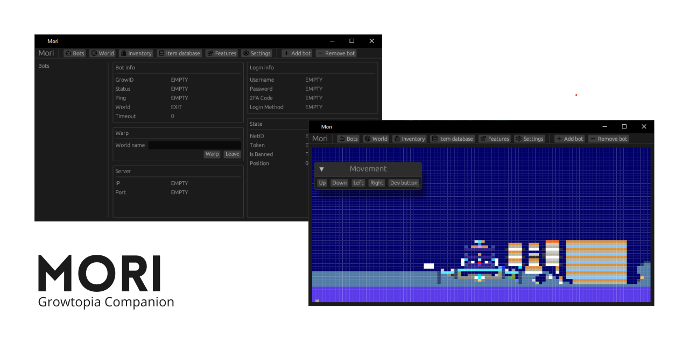

 

<h3 align="center">Mori</h3>

Your Cross-Platform Growtopia Companion

[Discord link for communication](https://discord.gg/a6FqT4G3dR)

## About The Project

There are many Growtopia companion tools available, but almost all of them are Windows-only, and I'm here to change that. Instead of being a GUI-focused app, I want to do something creative. This will be compiled as a CLI program, and it will open a port that you can use to preview the bots in your favorite browser, including their location in the world, manipulating location, and more. This is programmed in Rust, ensuring high performance and safety.

Star this project if you're interested in its journey!
 
Any contribution would help alot.

## Features

- [x] GUI (If you prefer to use a GUI)
- [ ] Web GUI
- [x] Auto update following the game client (version & items.dat)
- [x] Adding multi bot
- [x] Item database
- [x] Inventory
- [x] World map preview
- [x] Growscan
- [x] Bot movement + findpath
- [x] Drop, trash item
- [x] Warp
- [x] Punch, place
- [x] Auto collect item
- [x] Auto Reconnect
- [x] Google login ( Currently using API [growtopia-token](https://github.com/CLOEI/growtopia-token))
- [x] Session refresh
- [x] Legacy login
- [ ] Apple login
- [x] Ubisoft-steam login - (Build steamtoken and place it in the project root directory)
- [x] Auto link ubisoft account to steam account
- [x] Configureable delay
- [x] Embedded scripting
- [x] Bot terminal view
- [x] Better item database with item image preview
- [ ] Better world map preview with texture
- [ ] NPC
- [ ] Auto rotation
- [ ] Auto dirt farm
- [ ] Auto tutorial
- [x] Auto clear world
- [x] Auto Punch and Break
- [x] Spam
- [x] Socks5 support

## Note

This is for educational purposes only. I am not responsible for any misuse of this tool. You also not allowed to sell or re-upload this tool as your own without my permission. use it at your own risk.

<a property="dct:title" rel="cc:attributionURL" href="https://github.com/CLOEI/Mori">Mori</a> by <a rel="cc:attributionURL dct:creator" property="cc:attributionName" href="https://github.com/CLOEI">Cendy</a> is licensed under <a href="https://creativecommons.org/licenses/by-nc-sa/4.0/?ref=chooser-v1" target="_blank" rel="license noopener noreferrer" style="display:inline-block;">CC BY-NC-SA 4.0</a>

