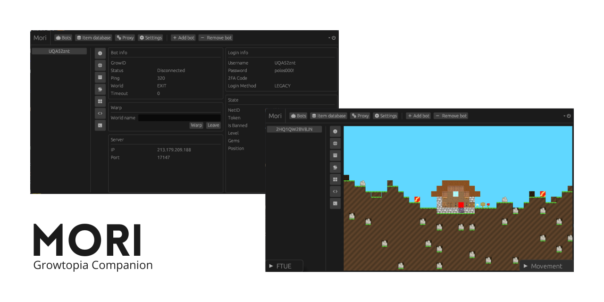

<div align="center">
  

  <h1>Mori</h1>
  <p><strong>Your Cross-Platform Growtopia Companion</strong></p>

  <p>
    <a href="https://github.com/CLOEI/Mori/stargazers"></a>
    <a href="https://creativecommons.org/licenses/by-nc-sa/4.0/"></a>
    <a href="https://discord.gg/a6FqT4G3dR"></a>
  </p>

  <p>
    <a href="https://discord.gg/a6FqT4G3dR">Discord</a> ·
    <a href="https://github.com/CLOEI/Mori/issues">Report Bug</a> ·
    <a href="https://github.com/CLOEI/Mori/issues">Request Feature</a>
  </p>
</div>

---

## About

Most Growtopia companion tools are Windows-only. Mori changes that. It's a cross-platform CLI bot framework written in **Rust** that exposes a local web interface, letting you monitor and control your bots from any browser. No bloated GUI, no platform lock-in.

> Star this project if you're following along — any contribution helps a lot!

## Features

### Interface
| | Feature | Description |
|---|---|---|
| ✅ | Web GUI | Control and monitor bots from any browser |
| ✅ | World map preview | Live tile map of the current world |
| ✅ | World map with textures | Textured world map rendering |
| ✅ | Bot terminal view | Real-time bot log output |
| ✅ | Item image preview | Item icons in the database |

### Bot Actions
| | Feature | Description |
|---|---|---|
| ✅ | Multi-bot support | Run and manage multiple bots at once |
| ✅ | Bot movement + pathfinding | Automatic navigation across the world |
| ✅ | Warp | Teleport to any world |
| ✅ | Punch & place | Block interaction |
| ✅ | Drop / trash item | Inventory management actions |
| ✅ | Auto collect | Pick up dropped items automatically |
| ✅ | Auto reconnect | Reconnects on disconnect |

### Scripting
| | Feature | Description |
|---|---|---|
| ✅ | Embedded Lua scripting | Automate anything with Lua 5.5 |
| ✅ | Configurable delays | Tune timing for actions via script |

### Authentication & Network
| | Feature | Description |
|---|---|---|
| ✅ | Legacy login | Username + password login |
| ✅ | Session refresh | Keeps sessions alive automatically |
| ✅ | Socks5 proxy | Route traffic through a proxy |
| 🔲 | Google login | OAuth via growtopia-token |
| 🔲 | Apple login | Apple ID authentication |

### Data
| | Feature | Description |
|---|---|---|
| ✅ | Item database | Searchable item reference |
| ✅ | Inventory | View bot inventory |
| ✅ | Growscan | World block scanning |
| 🔲 | Auto-update | Fetch latest version & items.dat automatically |

## Getting Started

### Prerequisites

- [Rust](https://rustup.rs/) (edition 2024)

### Build

```bash
git clone https://github.com/CLOEI/Mori.git
cd Mori
cd web
bun run install
bun run build
cd ..
cargo build --release
```

### Run

```bash
./target/release/Mori
```

Then open your browser at `http://localhost:3000` to access the web interface.

## Contributors

Thanks to everyone who has contributed to Mori!

<!-- ALL-CONTRIBUTORS-LIST:START - Do not remove or modify this section -->
<!-- prettier-ignore-start -->
<!-- markdownlint-disable -->
<table>
  <tbody>
    <tr>
      <td align="center" valign="top" width="14.28%"><a href="http://cendy.xyz"><br /><sub><b>Cendy</b></sub></a><br /><a href="#code-CLOEI" title="Code">💻</a></td>
      <td align="center" valign="top" width="14.28%"><a href="https://github.com/badewen"><br /><sub><b>badewen</b></sub></a><br /><a href="#research-badewen" title="Research">🔬</a> <a href="#bug-badewen" title="Bug reports">🐛</a></td>
      <td align="center" valign="top" width="14.28%"><a href="https://jad.li"><br /><sub><b>Hendra Gunawan</b></sub></a><br /><a href="#design-JadlionHD" title="Design">🎨</a></td>
      <td align="center" valign="top" width="14.28%"><a href="https://github.com/ToyFarms"><br /><sub><b>shafarrahman</b></sub></a><br /><a href="#bug-ToyFarms" title="Bug reports">🐛</a></td>
    </tr>
  </tbody>
</table>

<!-- markdownlint-restore -->
<!-- prettier-ignore-end -->

<!-- ALL-CONTRIBUTORS-LIST:END -->


## Note

This tool is for **educational purposes only**. The author is not responsible for any misuse. You are not allowed to sell or re-upload this tool as your own without permission. Use at your own risk.

---

<p align="center">
  <a property="dct:title" rel="cc:attributionURL" href="https://github.com/CLOEI/Mori">Mori</a> by <a rel="cc:attributionURL dct:creator" property="cc:attributionName" href="https://github.com/CLOEI">Cendy</a> is licensed under
  <a href="https://creativecommons.org/licenses/by-nc-sa/4.0/" target="_blank" rel="license noopener noreferrer">CC BY-NC-SA 4.0</a>
</p>
